# Deploying Your First LLM on OpenShift AI

Get from a bare OpenShift cluster with GPUs to a running LLM inference endpoint using OpenShift AI and KServe with vLLM.

**Audience:** Experienced OpenShift administrators evaluating OpenShift AI for Gen AI model serving.

**Result:** A Llama 3.2 3B Instruct model served via an OpenAI-compatible API on a GPU node.

**Time:** ~30 minutes (plus ~10 min for model pull on first deploy).

> [!NOTE]
> This does tutorial does not handle all possible issues that might involve the GPU accelerator enablement. In case of problems consult the documentation.

- [NVIDIA GPU Operator docs](https://docs.nvidia.com/datacenter/cloud-native/openshift/latest/index.html)
- [OpenShift AI docs](https://docs.redhat.com/en/documentation/red_hat_openshift_ai_self-managed/3.5)

## Prerequisites

- OpenShift 4.16+ cluster with `cluster-admin` access
- At least one worker node with an NVIDIA GPU (this tutorial uses an L4, but any supported GPU works)
- `oc` CLI authenticated to the cluster
- `jq` (used in Step 1 verification)
- Access to `registry.redhat.io` (valid pull secret)

> [!WARNING]
> If the cluster already has OpenShift AI or related operators installed, execute only the verification steps and adapt the missing parts. Then move forward to Step 6 (model deployment).

---

## Step 1 — Detect GPU Hardware (Node Feature Discovery)

NFD scans nodes for hardware features and applies labels. The GPU Operator depends on these labels to know where to install drivers.

```bash
oc apply -f resources/operators/01-nfd-namespace.yaml
oc apply -f resources/operators/02-nfd-operatorgroup.yaml
oc apply -f resources/operators/03-nfd-subscription.yaml
```

Wait for the operator to install:

```bash
oc wait --for=condition=CatalogSourcesUnhealthy=False \
  subscription/nfd -n openshift-nfd --timeout=120s
NFD_CSV=$(oc get subscription nfd -n openshift-nfd -o jsonpath='{.status.currentCSV}')
oc wait --for=jsonpath='{.status.phase}'=Succeeded \
  csv/$NFD_CSV -n openshift-nfd --timeout=300s
```

Create the NFD instance to start scanning:

```bash
oc apply -f resources/operators/04-nfd-instance.yaml
```

**Verify:** After ~60 seconds, NFD labels should appear on GPU nodes:

```bash
oc get node -o json | jq -r '.items[].metadata.labels | to_entries[] | select((.key | startswith("feature.node.kubernetes.io/pci-")) and (.value == "true") and (.key | contains("10de"))) | "\(.key)=\(.value)"'
```

Expected output includes `feature.node.kubernetes.io/pci-0302_10de.present=true` (NVIDIA vendor ID `10de`). The full `nvidia.com/gpu.present=true` label appears after Step 2 when GPU Feature Discovery runs.

---

## Step 2 — Install the NVIDIA GPU Operator

The GPU Operator installs the NVIDIA driver, device plugin, and container toolkit so that pods can request `nvidia.com/gpu` resources.

```bash
oc apply -f resources/operators/05-gpu-namespace.yaml
oc apply -f resources/operators/06-gpu-operatorgroup.yaml
oc apply -f resources/operators/07-gpu-subscription.yaml
```

Wait for the operator, then create the ClusterPolicy:

```bash
oc wait --for=jsonpath='{.status.state}'=AtLatestKnown \
  subscription/gpu-operator-certified -n nvidia-gpu-operator --timeout=180s
GPU_CSV=$(oc get subscription gpu-operator-certified -n nvidia-gpu-operator -o jsonpath='{.status.installedCSV}')
oc wait --for=jsonpath='{.status.phase}'=Succeeded \
  csv/$GPU_CSV -n nvidia-gpu-operator --timeout=300s
oc apply -f resources/operators/08-gpu-clusterpolicy.yaml
```

Wait for the ClusterPolicy to reconcile:

```bash
oc wait --for=jsonpath='{.status.state}'=ready \
  clusterpolicy/gpu-cluster-policy --timeout=600s
```

**Verify:** Driver installation takes 3–5 minutes. The ClusterPolicy wait above can succeed before drivers finish compiling and before GPUs are allocatable — do not proceed until the loop below exits:

```bash
MAX_WAIT_SECONDS=1800  # 30 minutes
START_TIME=$(date +%s)
until oc get nodes -o jsonpath='{range .items[*]}{.status.allocatable.nvidia\.com/gpu}{" "}{end}' | grep -q '[1-9]'; do
  NOW=$(date +%s)
  ELAPSED=$((NOW - START_TIME))
  if [ "$ELAPSED" -ge "$MAX_WAIT_SECONDS" ]; then
    echo "Timed out waiting for allocatable GPUs after ${MAX_WAIT_SECONDS}s."
    echo "Run: oc get nodes -o 'custom-columns=NAME:.metadata.name,GPUS:.status.allocatable.nvidia\\.com/gpu'"
    echo "Then check Troubleshooting (ClusterPolicy not ready / Pod pending, no GPU)."
    exit 1
  fi
  echo "Waiting for nvidia.com/gpu... (${ELAPSED}s elapsed)"
  sleep 10
done
oc get nodes -o 'custom-columns=NAME:.metadata.name,GPUS:.status.allocatable.nvidia\.com/gpu'
```

---

## Step 3 — Install OpenShift AI Dependencies

This tutorial deploys the model in **Standard** mode (raw Deployment, no Knative) with auth disabled, so only Serverless and Service Mesh are installed here. Authorino and Pipelines are not required for this walkthrough.

```bash
# OpenShift Serverless
oc apply -f resources/operators/09-serverless-namespace.yaml
oc apply -f resources/operators/10-serverless-operatorgroup.yaml
oc apply -f resources/operators/11-serverless-subscription.yaml

# Service Mesh (Istio/Sail) — may already be platform-managed on OCP 4.16+
oc get subscription servicemeshoperator3 -n openshift-operators &>/dev/null \
  || oc apply -f resources/operators/12-servicemesh-subscription.yaml
```

Wait for the operators to install:

```bash
oc wait --for=jsonpath='{.status.state}'=AtLatestKnown \
  subscription/serverless-operator -n openshift-serverless --timeout=300s
SERVERLESS_CSV=$(oc get subscription serverless-operator -n openshift-serverless -o jsonpath='{.status.installedCSV}')
oc wait --for=jsonpath='{.status.phase}'=Succeeded \
  csv/$SERVERLESS_CSV -n openshift-serverless --timeout=300s

MESH_CSV=$(oc get subscription servicemeshoperator3 -n openshift-operators -o jsonpath='{.status.installedCSV}')
oc wait --for=jsonpath='{.status.phase}'=Succeeded \
  csv/$MESH_CSV -n openshift-operators --timeout=300s
```

---

## Step 4 — Install the OpenShift AI Operator

```bash
oc apply -f resources/operators/15-rhods-namespace.yaml
oc apply -f resources/operators/16-rhods-operatorgroup.yaml
oc apply -f resources/operators/17-rhods-subscription.yaml
```

Wait for the CSV to succeed:

```bash
oc wait --for=jsonpath='{.status.state}'=AtLatestKnown \
  subscription/rhods-operator -n redhat-ods-operator --timeout=300s
RHODS_CSV=$(oc get subscription rhods-operator -n redhat-ods-operator -o jsonpath='{.status.installedCSV}')
oc wait --for=jsonpath='{.status.phase}'=Succeeded \
  csv/$RHODS_CSV -n redhat-ods-operator --timeout=300s
```

---

## Step 5 — Configure OpenShift AI

Two custom resources configure the platform:

1. **DSCInitialization** — sets up namespaces and monitoring
2. **DataScienceCluster** — enables components (KServe, Dashboard, Llama Stack Operator, etc.)

Wait ~30 seconds for the operator webhook to become available, then apply:

```bash
sleep 30
oc apply -f resources/operators/18-dsci.yaml
oc apply -f resources/operators/19-datasciencecluster.yaml
```

Wait for reconciliation:

```bash
oc wait --for=jsonpath='{.status.phase}'=Ready \
  datasciencecluster/default-dsc --timeout=300s
```

Enable the Gen AI Studio (Playground) in the dashboard. The operator creates `OdhDashboardConfig` with defaults that hide this feature — patch it:

```bash
oc patch odhdashboardconfig odh-dashboard-config -n redhat-ods-applications \
  --type=merge -p '{"spec":{"dashboardConfig":{"genAiStudio":true}}}'
```

**Verify:** The OpenShift AI dashboard is accessible and Gen AI Studio is enabled:

```bash
oc get route rhods-dashboard -n redhat-ods-applications
```

---

## Step 6 — Deploy a Model

First, create the GPU hardware profile that the InferenceService references:

```bash
oc apply -f resources/operators/20-gpu-hardwareprofile.yaml
```

Then create a namespace and deploy Llama 3.2 3B Instruct using KServe with vLLM:

```bash
oc apply -f resources/my-first-model/01-namespace.yaml
oc apply -f resources/my-first-model/02-connection-secret.yaml
oc apply -f resources/my-first-model/03-serving-runtime.yaml
oc apply -f resources/my-first-model/04-inference-service.yaml
```

### What each resource does


| Resource             | Purpose                                                                                                         |
| -------------------- | --------------------------------------------------------------------------------------------------------------- |
| **Namespace**        | Isolated project for the model                                                                                  |
| **Secret**           | OCI URI for the OpenShift AI dashboard connection (`oci://quay.io/redhat-ai-services/modelcar-catalog:llama-3.2-3b-instruct`) |
| **ServingRuntime**   | Defines vLLM as the inference engine with the Red Hat container image                                           |
| **InferenceService** | Declares the model deployment: GPU request, memory limits, vLLM args                                            |


### Key InferenceService settings

```yaml
serving.kserve.io/deploymentMode: Standard   # Raw Deployment (no Knative)
security.opendatahub.io/enable-auth: "false"  # No token auth (evaluation)

resources:
  requests:
    nvidia.com/gpu: "1"
  limits:
    nvidia.com/gpu: "1"
    memory: 16Gi

args:
  - --dtype=half              # FP16 inference
  - --max-model-len=20000    # Context window
  - --gpu-memory-utilization=0.95
```

### Wait for the model to be ready

The first deploy pulls the model image (~2–3 GB). Track progress:

```bash
oc logs -f deployment/llama-32-3b-instruct-predictor -n my-first-model
```

Wait for the InferenceService to report ready:

```bash
oc wait --for=condition=Ready \
  inferenceservice/llama-32-3b-instruct -n my-first-model --timeout=600s
```

---

## Step 7 — Test the Endpoint

The model exposes an OpenAI-compatible API inside the cluster.

The predictor Service is headless (`clusterIP: None`), so DNS resolves to pod IPs. Use port **8080** (the container port), not the Service's port 80.

### From within the cluster (debug pod)

```bash
oc run curl-test --rm -i --restart=Never -n my-first-model \
  --image=registry.access.redhat.com/ubi9/ubi-minimal -- \
  curl -s http://llama-32-3b-instruct-predictor.my-first-model.svc.cluster.local:8080/v1/chat/completions \
    -H "Content-Type: application/json" \
    -d '{"model":"llama-32-3b-instruct","messages":[{"role":"user","content":"What is OpenShift AI in one sentence?"}]}'
```

### From outside the cluster (port-forward)

Port-forward directly to the deployment:

```bash
oc port-forward deployment/llama-32-3b-instruct-predictor -n my-first-model 8080:8080
```

Then in another terminal:

```bash
curl -s http://localhost:8080/v1/chat/completions \
  -H "Content-Type: application/json" \
  -d '{"model":"llama-32-3b-instruct","messages":[{"role":"user","content":"What is OpenShift AI in one sentence?"}]}'
```

### Available API endpoints


| Endpoint               | Description                     |
| ---------------------- | ------------------------------- |
| `/v1/chat/completions` | Chat (multi-turn conversations) |
| `/v1/completions`      | Text completion                 |
| `/v1/models`           | List served models              |
| `/health`              | Health check                    |


---

## Troubleshooting


| Symptom                    | Check                                                               |
| -------------------------- | ------------------------------------------------------------------- |
| Pod pending, no GPU        | `oc get nodes -o 'custom-columns=NAME:.metadata.name,GPUS:.status.allocatable.nvidia\.com/gpu'` — verify GPUS > 0 |
| ClusterPolicy not ready    | `oc get pods -n nvidia-gpu-operator` — look for driver build pods   |
| InferenceService not ready | `oc get events -n my-first-model --sort-by=.lastTimestamp`          |
| OOM during model load      | Increase `memory` limits or reduce `--max-model-len`                |
| Pull image error           | Verify pull secret has access to `registry.redhat.io` and `quay.io` |
| Serverless CSV failed      | Confirm `10-serverless-operatorgroup.yaml` uses AllNamespaces (`spec: {}`) |


---

## Architecture Overview

```
┌─────────────────────────────────────────────────────────────────┐
│  OpenShift Cluster                                              │
│                                                                 │
│  ┌──────────┐  ┌──────────────┐  ┌────────────────────────────┐ │
│  │   NFD    │──│ GPU Operator │──│  Node (nvidia.com/gpu: 1)  │ │
│  └──────────┘  └──────────────┘  └────────────────────────────┘ │
│                                                                 │
│  ┌────────────────────────────────────────────────────────────┐ │
│  │  OpenShift AI (RHODS)                                      │ │
│  │  ┌─────────┐  ┌─────────────────────────────────────────┐  │ │
│  │  │ KServe  │──│  my-first-model namespace               │  │ │
│  │  └─────────┘  │  ┌──────────────┐  ┌─────────────────┐  │  │ │
│  │               │  │ServingRuntime│──│InferenceService │  │  │ │
│  │               │  │   (vLLM)     │  │ (Llama 3.2)     │  │  │ │
│  │               │  └──────────────┘  └─────────────────┘  │  │ │
│  │               └─────────────────────────────────────────┘  │ │
│  └────────────────────────────────────────────────────────────┘ │
└─────────────────────────────────────────────────────────────────┘
```

---

## Step 6 Alternative: Clickops model serving

This section covers the same outcome as [Step 6](#step-6--deploy-a-model) using the OpenShift AI dashboard instead of YAML. Complete Steps 1–5 first so the cluster has GPUs, OpenShift AI, and the `gpu-profile` hardware profile from `20-gpu-hardwareprofile.yaml`.

### Prerequisite

Create the GPU hardware profile

```bash
oc apply -f resources/operators/20-gpu-hardwareprofile.yaml
```

### Go into OpenShift AI

Open the **Application Launcher** (grid icon) in the OpenShift console and select **Red Hat OpenShift AI** under **OpenShift Self Managed Services**.

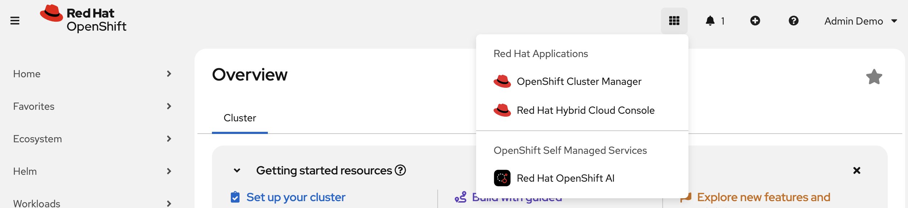

### Create a project

In the left sidebar, go to **Projects** and click **Create project**. Name it `my-clickops-model` and click **Create**.

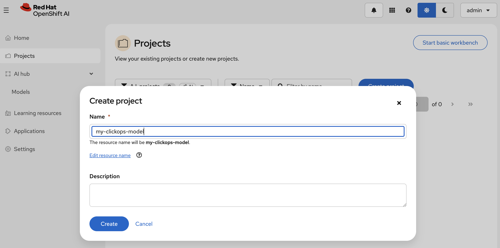

### Browse the model catalog

Go to **AI hub → Models**, search for `llama`, and pick a validated model from the results.

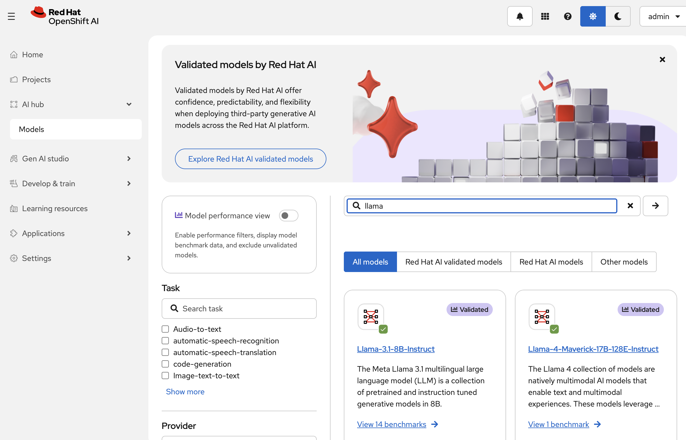

### Select a model

Open the model detail page and click **Deploy model**.

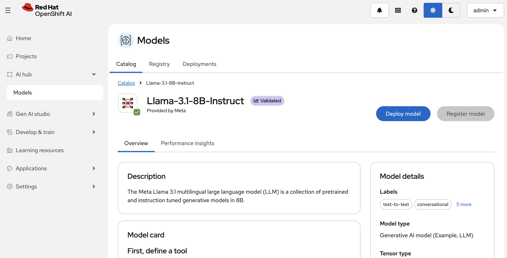

### Deploy the model

The deployment wizard has four steps. Catalog import fills in most fields; confirm the settings below match the YAML walkthrough.

**1. Model details** — URI and model type are pre-filled from the catalog.

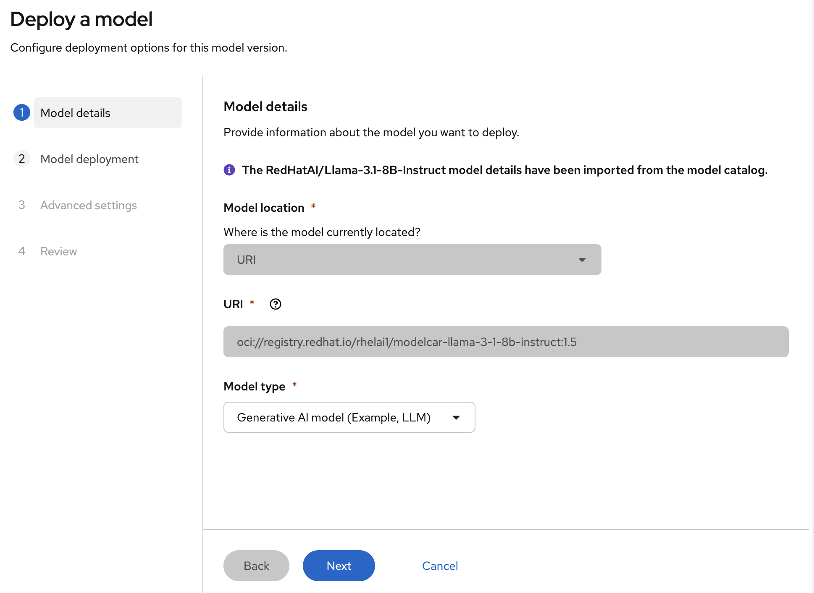

**2. Model deployment** — Select project `my-clickops-model` and hardware profile `gpu-profile` (1 GPU, 12 GiB memory).

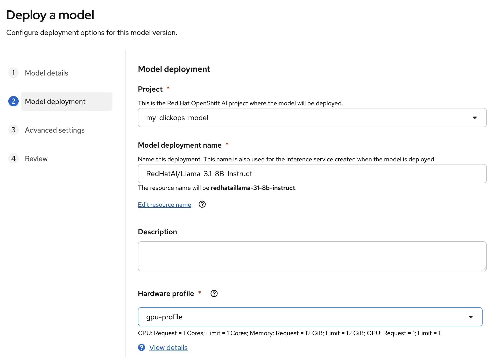

**3. Advanced settings** — Enable **Publish as AI asset endpoint** so the model appears in the Playground. Leave token authentication off for evaluation. Add the same vLLM runtime arguments as Step 6:

```
--dtype=half
--max-model-len=20000
--gpu-memory-utilization=0.95
```

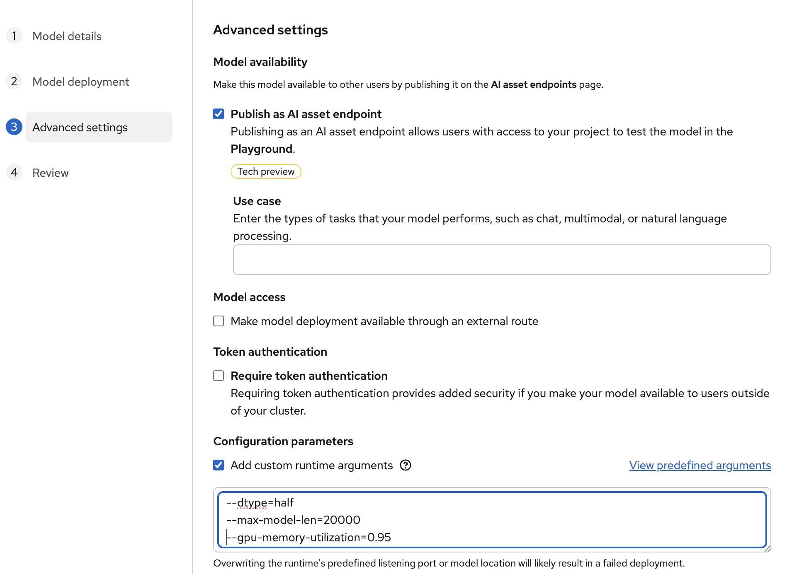

**4. Review** — Confirm project, hardware profile, vLLM runtime, and runtime arguments, then deploy.

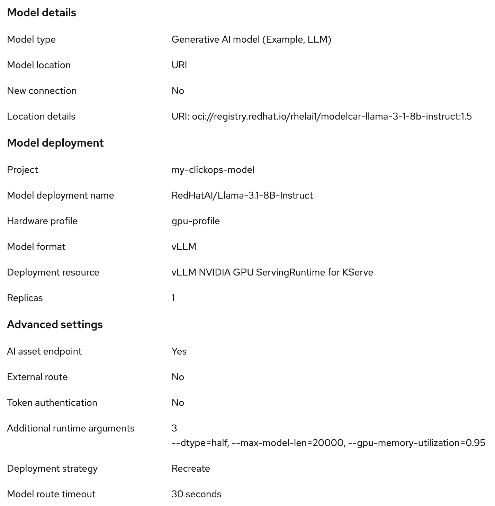

Wait for the deployment to reach **Ready** on the **Models → Deployments** tab (first deploy pulls the model image; allow ~10 minutes).

### Test in the Playground

Go to **Gen AI studio → Playground**, select project `my-clickops-model`, and click **Create playground**.

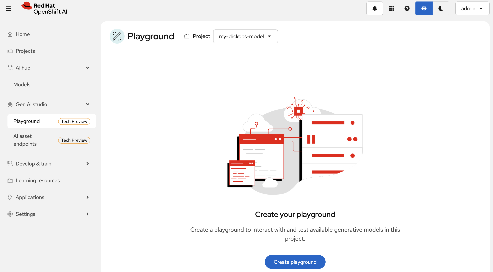

Select the deployed model and click **Create**.

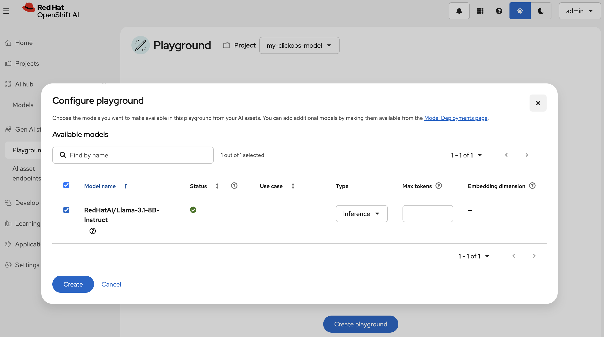

Send a prompt to verify the endpoint. The Playground uses the same OpenAI-compatible API as Step 7.

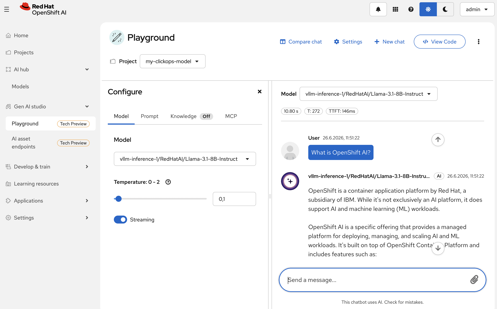

---

## Cleanup

Remove just the model deployment:

```bash
oc delete inferenceservice llama-32-3b-instruct -n my-first-model
oc delete namespace my-first-model
```

To fully uninstall everything (operators, CRDs, node labels) and return to a fresh cluster, run the cleanup script.

> [!CAUTION]
> Only use in throw-away clusters. This script uninstalls and deletes a lot of stuff.

```bash
./cleanup.sh
```

The script prompts for confirmation (`Type 'yes' to confirm`). It also removes Authorino, Pipelines, and other operators that may already be present on a preconfigured OpenShift AI cluster, even though this tutorial does not install them.